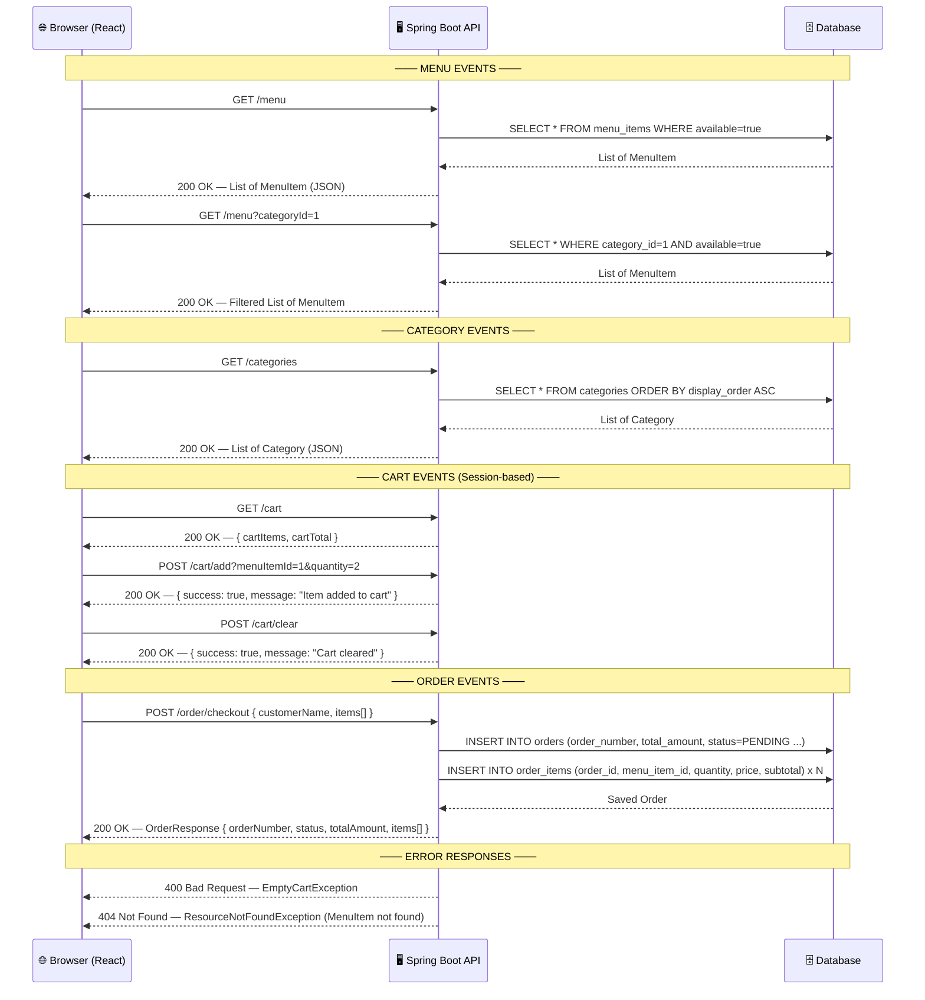

# Cafe Kiosk — イベント定義 (API Event Definitions)

All REST API endpoints exposed by the Spring Boot backend, including request/response contracts.



## Endpoint Summary

| Method | Endpoint | Description | Response |
|---|---|---|---|
| `GET` | `/categories` | Get all categories sorted by display order | `List<Category>` |
| `GET` | `/menu` | Get all available menu items | `List<MenuItem>` |
| `GET` | `/menu?categoryId={id}` | Get available menu items filtered by category | `List<MenuItem>` |
| `GET` | `/cart` | View current session cart | `{ cartItems, cartTotal }` |
| `POST` | `/cart/add` | Add item to session cart | `{ success, message }` |
| `POST` | `/cart/clear` | Clear session cart | `{ success, message }` |
| `POST` | `/order/checkout` | Place an order (client-side or session cart) | `OrderResponse` |

## Request / Response Schema

```
OrderRequest {
  customerName : String          (optional)
  items[]      : CartItem[]
    ├─ menuItemId  : Long
    ├─ quantity    : Integer
    ├─ price       : BigDecimal
    └─ subtotal    : BigDecimal
}

OrderResponse {
  orderNumber   : String         e.g. "ORD-20260303-0001"
  customerName  : String
  status        : String         "PENDING"
  totalAmount   : BigDecimal
  orderedAt     : LocalDateTime  "yyyy-MM-dd'T'HH:mm:ss"
  items[]       : OrderItemResponse[]
    ├─ menuItemName : String
    ├─ price        : BigDecimal
    ├─ quantity     : Integer
    └─ subtotal     : BigDecimal
}
```

## Error Responses

| Status | Exception | Trigger |
|---|---|---|
| `400 Bad Request` | `EmptyCartException` | Checkout called with no items in cart |
| `404 Not Found` | `ResourceNotFoundException` | `menuItemId` does not exist in DB |
