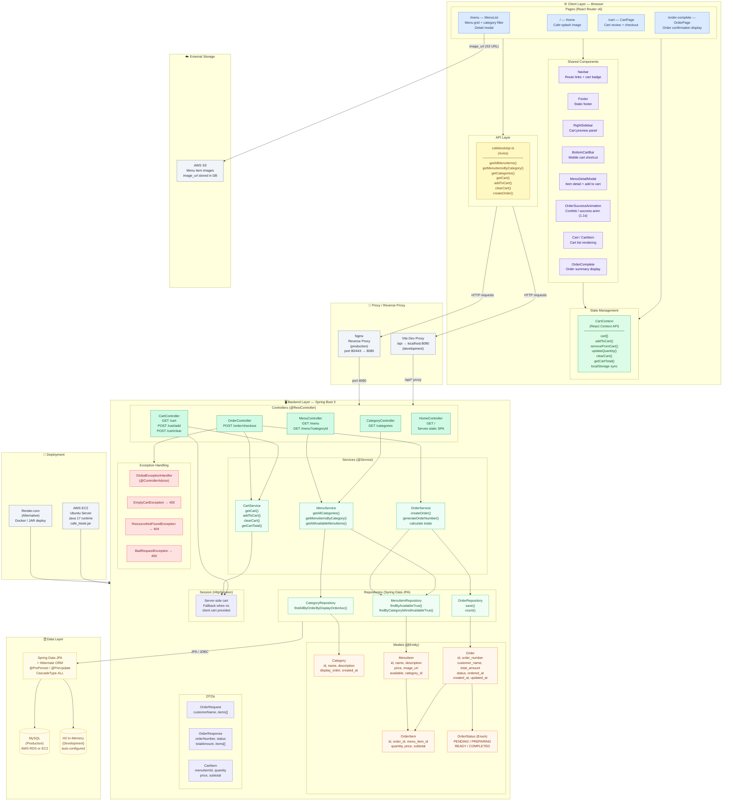

# Cafe Kiosk — 機能のアーキテクチャ (Functional Architecture)

Overview of all layers, components, and their responsibilities across the system.



## Layer Responsibilities

| Layer | Technology | Responsibility |
|---|---|---|
| **Pages** | React 19 + React Router v6 | Screen routing and top-level layout per route |
| **Components** | React + styled-components | Reusable UI blocks (Navbar, Cart, Modal, etc.) |
| **State** | React Context API + localStorage | Global cart state shared across all pages |
| **API Layer** | Axios | HTTP calls to Spring Boot backend, type-safe DTOs |
| **Proxy** | Vite (dev) / Nginx (prod) | Route `/api/*` requests to backend port 8080 |
| **Controllers** | Spring Boot `@RestController` | Accept HTTP requests, delegate to services |
| **Services** | Spring Boot `@Service` | Business logic — order creation, menu filtering |
| **Repositories** | Spring Data JPA | Database queries via JPA interfaces |
| **Models** | JPA `@Entity` | ORM mapping to DB tables with lifecycle hooks |
| **DTOs** | Plain Java classes | Request/response contracts between layers |
| **Exception Handler** | `@ControllerAdvice` | Centralized error handling → HTTP status codes |
| **Database** | MySQL (prod) / H2 (dev) | Persistent storage for menus, orders |
| **Storage** | AWS S3 | Menu item image hosting |
| **Deployment** | AWS EC2 / Render | Runs the Spring Boot JAR + serves frontend static files |

## Tech Stack Summary

```
Frontend  : React 19 · TypeScript · Vite · React Router v6
           styled-components · Bootstrap 5 · Axios · framer-motion

Backend   : Spring Boot 3 · Java 17 · Spring Data JPA · Hibernate
           Lombok · Jakarta EE · HttpSession

Database  : MySQL 8 (production) · H2 (development)

Storage   : AWS S3 (images)

Deploy    : AWS EC2 (Ubuntu) + Nginx  OR  Render.com
```
