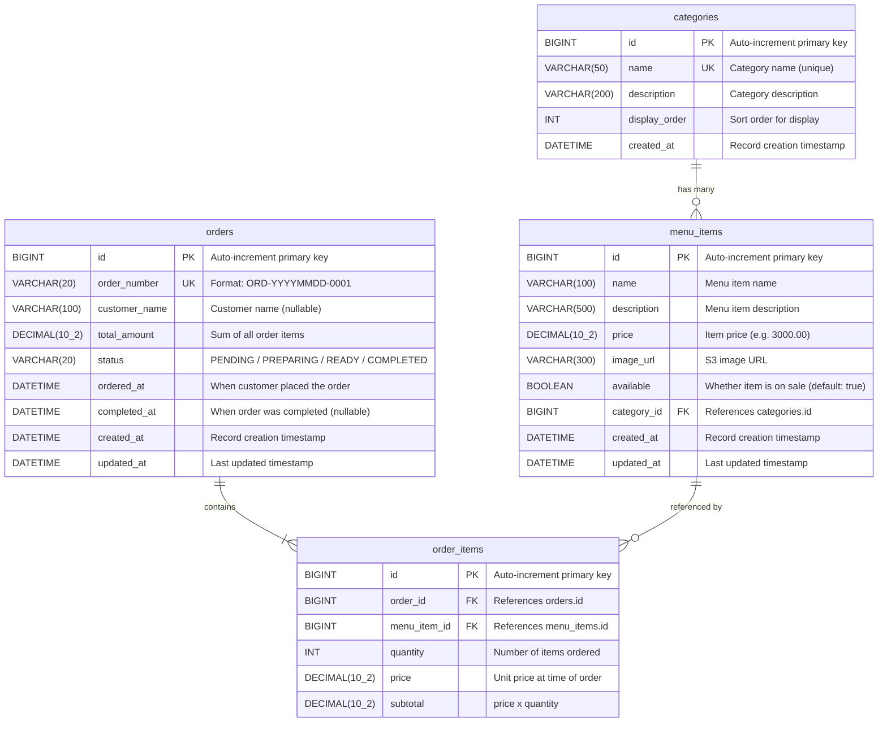

# Cafe Kiosk — テーブルとの関連図 (ER Diagram)

Table relationships, columns, data types, and primary/foreign keys.

## Relations

| From | To | Type | Description |
|---|---|---|---|
| `categories` | `menu_items` | One-to-Many | One category holds many menu items |
| `orders` | `order_items` | One-to-Many | One order contains one or more items |
| `menu_items` | `order_items` | One-to-Many | A menu item can appear in many orders |

## OrderStatus Enum

| Value | Description |
|---|---|
| `PENDING` | Order received, waiting to be processed |
| `PREPARING` | Kitchen is preparing the order |
| `READY` | Order is ready for pickup |
| `COMPLETED` | Order has been picked up / fulfilled |
