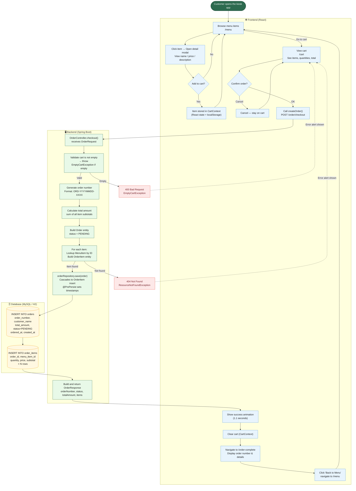

# Cafe Kiosk — プロセス図 (Order Process Diagram)

End-to-end flow from the customer browsing menus to the order being saved in the database.



## Color Legend

| Color | Layer | Description |
|---|---|---|
| 🔵 Blue | Frontend (React) | UI interactions, navigation, cart state |
| 🟢 Green | Backend (Spring Boot) | Business logic, order creation, validation |
| 🟡 Yellow | Database | SQL INSERT operations |
| 🔴 Red | Errors | Exception responses (400 / 404) |

## Order Number Format

```
ORD-{YYYYMMDD}-{SEQUENCE}
e.g. ORD-20260303-0001

SEQUENCE = (total orders in DB + 1), zero-padded to 4 digits
```

## Order Lifecycle

```
PENDING ──► PREPARING ──► READY ──► COMPLETED
  │
  └─ Set automatically on creation (@PrePersist)
     completedAt recorded when status → COMPLETED (@PreUpdate)
```
