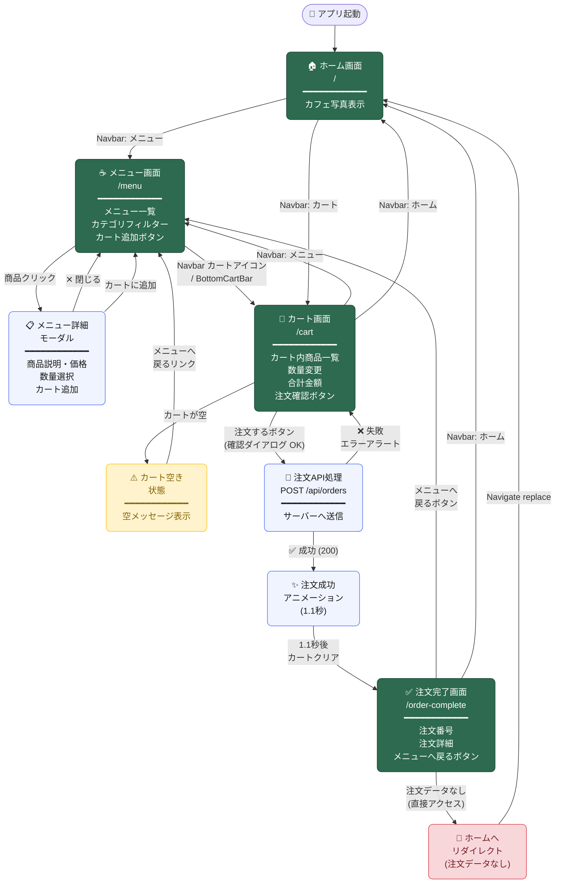

# Cafe Kiosk — 画面遷移図 (Screen Transition Diagram)

## 画面一覧

| 画面名 | パス | 説明 |
|---|---|---|
| ホーム画面 | `/` | カフェ写真のスプラッシュ画面 |
| メニュー画面 | `/menu` | 商品一覧・カテゴリフィルター・モーダル詳細 |
| カート画面 | `/cart` | 注文内容確認・合計金額・注文実行 |
| 注文完了画面 | `/order-complete` | 注文番号・詳細表示（注文データなしの場合ホームへリダイレクト） |

## 主要な遷移ルール

- **Navbar** — 全ページから `/`・`/menu`・`/cart` へ常時遷移可能
- **注文完了ガード** — `/order-complete` に直接アクセスすると `Navigate replace` でホームへリダイレクト
- **注文フロー** — カート → API送信 → 成功アニメーション(1.1秒) → カートクリア → 注文完了画面
