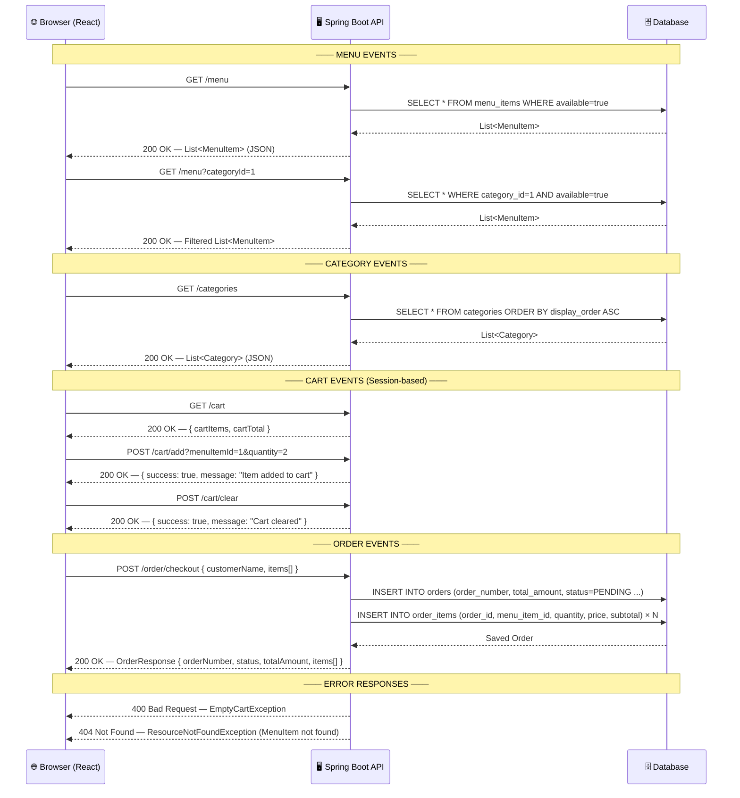
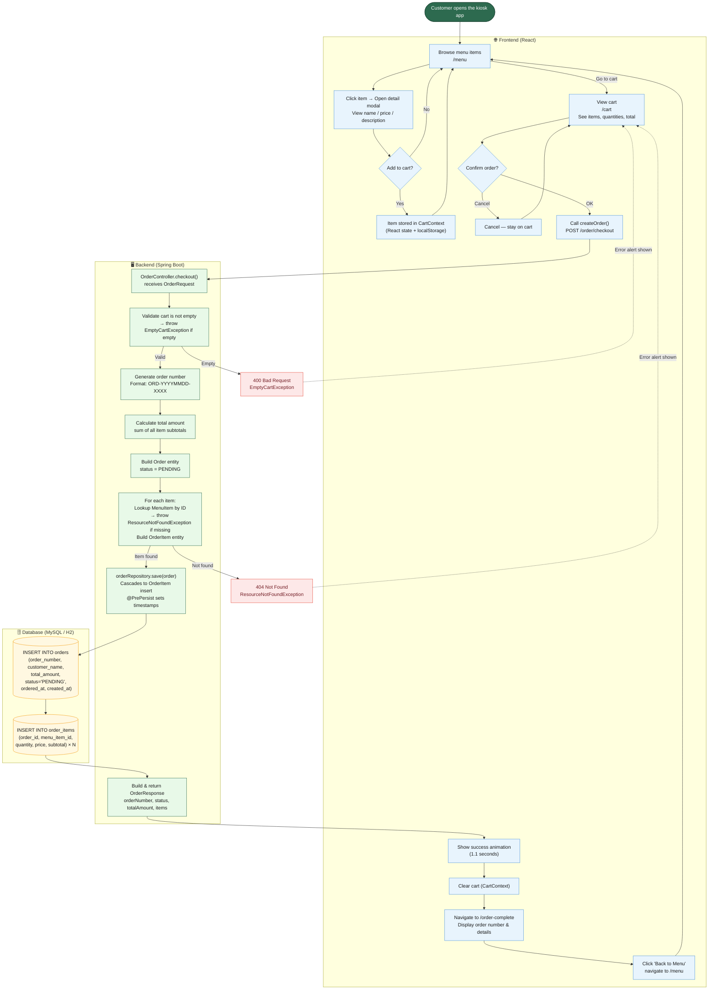

# Cafe Kiosk — System Diagrams

---

## 1. テーブルとの関連図 — Table Relationship Diagram (ER Diagram)

Shows the database tables, their columns, data types, and how they relate to each other.

```mermaid
erDiagram
    categories {
        BIGINT      id              PK  "Auto-increment primary key"
        VARCHAR(50) name            UK  "Category name (unique)"
        VARCHAR(200) description        "Category description"
        INT         display_order       "Sort order for display"
        DATETIME    created_at          "Record creation timestamp"
    }

    menu_items {
        BIGINT       id             PK  "Auto-increment primary key"
        VARCHAR(100) name               "Menu item name"
        VARCHAR(500) description        "Menu item description"
        DECIMAL(10,2) price             "Item price (e.g. 3000.00)"
        VARCHAR(300) image_url          "S3 image URL"
        BOOLEAN      available          "Whether item is on sale (default: true)"
        BIGINT       category_id    FK  "References categories.id"
        DATETIME     created_at         "Record creation timestamp"
        DATETIME     updated_at         "Last updated timestamp"
    }

    orders {
        BIGINT       id             PK  "Auto-increment primary key"
        VARCHAR(20)  order_number   UK  "Format: ORD-YYYYMMDD-0001"
        VARCHAR(100) customer_name      "Customer name (nullable)"
        DECIMAL(10,2) total_amount      "Sum of all order items"
        VARCHAR(20)  status             "PENDING / PREPARING / READY / COMPLETED"
        DATETIME     ordered_at         "When customer placed the order"
        DATETIME     completed_at       "When order was completed (nullable)"
        DATETIME     created_at         "Record creation timestamp"
        DATETIME     updated_at         "Last updated timestamp"
    }

    order_items {
        BIGINT       id             PK  "Auto-increment primary key"
        BIGINT       order_id       FK  "References orders.id"
        BIGINT       menu_item_id   FK  "References menu_items.id"
        INT          quantity           "Number of items ordered"
        DECIMAL(10,2) price             "Unit price at time of order"
        DECIMAL(10,2) subtotal          "price × quantity"
    }

    categories   ||--o{ menu_items  : "has many"
    orders       ||--|{ order_items  : "contains"
    menu_items   ||--o{ order_items  : "referenced by"
```

### OrderStatus Enum

| Value | Description |
|---|---|
| `PENDING` | Order received, waiting to be processed |
| `PREPARING` | Kitchen is preparing the order |
| `READY` | Order is ready for pickup |
| `COMPLETED` | Order has been picked up / fulfilled |

---

## 2. イベント定義 — API Event Definitions

All REST API endpoints exposed by the Spring Boot backend, including request/response contracts.



### Event Summary Table

| Method | Endpoint | Description | Response |
|---|---|---|---|
| `GET` | `/categories` | Get all categories sorted by display order | `List<Category>` |
| `GET` | `/menu` | Get all available menu items | `List<MenuItem>` |
| `GET` | `/menu?categoryId={id}` | Get available menu items filtered by category | `List<MenuItem>` |
| `GET` | `/cart` | View current session cart | `{ cartItems, cartTotal }` |
| `POST` | `/cart/add` | Add item to session cart | `{ success, message }` |
| `POST` | `/cart/clear` | Clear session cart | `{ success, message }` |
| `POST` | `/order/checkout` | Place an order (client-side or session cart) | `OrderResponse` |

### OrderRequest / OrderResponse Schema

```
OrderRequest {
  customerName : String          (optional)
  items[]      : CartItem[]
    ├─ menuItemId  : Long
    ├─ quantity    : Integer
    ├─ price       : BigDecimal
    └─ subtotal    : BigDecimal
}

OrderResponse {
  orderNumber   : String         e.g. "ORD-20260303-0001"
  customerName  : String
  status        : String         "PENDING"
  totalAmount   : BigDecimal
  orderedAt     : LocalDateTime
  items[]       : OrderItemResponse[]
    ├─ menuItemName : String
    ├─ price        : BigDecimal
    ├─ quantity     : Integer
    └─ subtotal     : BigDecimal
}
```

---

## 3. プロセス図 — Order Process Diagram

End-to-end flow from the customer browsing menus to the order being saved in the database.



### Order Number Generation Rule

```
Format : ORD-{YYYYMMDD}-{SEQUENCE}
Example: ORD-20260303-0001

- YYYYMMDD  = current date
- SEQUENCE  = (total order count in DB + 1), zero-padded to 4 digits
```

### Order Lifecycle

```
PENDING ──► PREPARING ──► READY ──► COMPLETED
  │
  └─ Initial status set automatically on order creation (@PrePersist)
     completedAt is recorded when status transitions to COMPLETED (@PreUpdate)
```
